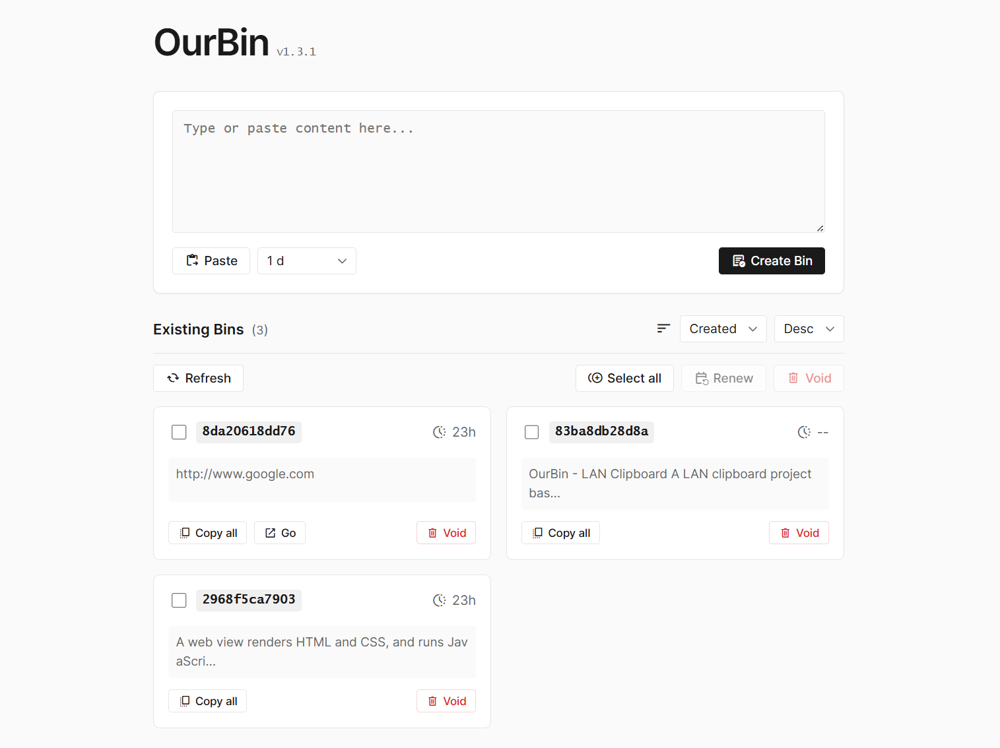

# OurBin - 内网剪贴板

> 一个基于 Python FastAPI + SQLite 的内网剪贴板项目，支持创建、编辑、管理和分享文本内容。


## 功能特性

### 核心功能
- ✅ 创建剪贴板内容（支持自定义过期时间，从分钟到永久）
- ✅ 通过 UUID 访问和编辑剪贴板内容
- ✅ 软删除功能
- ✅ 列出所有有效的剪贴板内容
- ✅ 批量操作（选择、删除、续期）
- ✅ 排序功能（按创建时间、过期时间排序）
- ✅ 清理已过期的 bin
- ✅ 数据库重置（带安全确认）
- ✅ RESTful API 设计
- ✅ 自动生成 API 文档

### 前端功能
- 📋 从剪贴板导入内容
- 🔍 实时搜索和筛选
- 📊 显示创建时间和过期时间
- 🔄 自动刷新列表
- 📝 在线编辑内容
- 🔗 一键复制 URL 或内容
- ⏰ 过期时间显示

## 技术栈

- **后端**: Python 3.11+, FastAPI, SQLite
- **前端**: HTML5, JavaScript (Vanilla)
- **部署**: Docker, Docker Compose
- **服务器**: Uvicorn (ASGI)

## 快速开始

### 方式一：Docker 部署（推荐）

1. **克隆项目**
```bash
git clone <repository-url>
cd ourbin
```

2. **创建数据目录**
```bash
mkdir -p data
```

3. **配置端口（可选）**
创建 `.env` 文件：
```bash
CUSTOM_PORT=8000
```

4. **启动服务**
```bash
docker-compose up -d
```

5. **查看日志**
```bash
docker-compose logs -f
```

6. **停止服务**
```bash
docker-compose down
```

服务将在 `http://localhost:8000` 启动（或你配置的端口）

### 方式二：本地运行

1. **安装依赖**
```bash
pip install -r requirements.txt
```

2. **运行服务**
```bash
python app.py
```

服务将在 `http://localhost:8000` 启动

## API 文档

启动服务后，可以访问：
- **Swagger UI**: http://localhost:8000/docs
- **ReDoc**: http://localhost:8000/redoc

## API 端点

### 创建剪贴板内容
```http
POST /api/bins
Content-Type: application/json

{
    "content": "剪贴板内容",
    "expiration_hours": 24  // 支持小数，如 0.083 表示 5 分钟
}
```

**响应**:
```json
{
    "uuid": "4cd4a4d332cb",
    "creation_time": 1704067200,
    "content": "剪贴板内容",
    "expiration_time": 1704153600
}
```

### 获取剪贴板内容
```http
GET /api/bins/{uuid}
```

### 更新剪贴板内容
```http
PUT /api/bins/{uuid}
Content-Type: application/json

{
    "content": "新的内容"
}
```

### 删除剪贴板内容（软删除）
```http
DELETE /api/bins/{uuid}
```

支持批量删除，多个 UUID 用逗号分隔：
```http
DELETE /api/bins/{uuid1},{uuid2},{uuid3}
```

### 列出所有剪贴板内容
```http
GET /api/bins?sort_by=creation_time&order=desc
```

**查询参数**:
- `sort_by`: 排序字段 (`creation_time`, `expiration_time`)
- `order`: 排序顺序 (`asc`, `desc`)

**响应**:
```json
[
    {
        "uuid": "4cd4a4d332cb",
        "creation_time": 1704067200,
        "expiration_time": 1704153600,
        "preview": "剪贴板内容预览..."
    }
]
```

### 批量续期（加1天）
```http
PUT /api/bins/renew
Content-Type: application/json

{
    "uuids": ["uuid1", "uuid2", "uuid3"]
}
```

### 清理已过期的 bin
```http
DELETE /api/bins/cleanup
```

删除所有 `expiration_time <= 当前时间` 的记录。

### 重置数据库
```http
DELETE /api/bins/reset
```

⚠️ **警告**: 此操作将删除所有数据！

### 健康检查
```http
GET /api/health
```

**响应**:
```json
{
    "status": "healthy",
    "version": "1.0.1"
}
```

## 数据库结构

```sql
CREATE TABLE bins (
    id INTEGER PRIMARY KEY AUTOINCREMENT,
    uuid TEXT UNIQUE NOT NULL,
    creation_time INTEGER NOT NULL,
    content TEXT NOT NULL,
    file_path TEXT,
    expiration_time INTEGER NOT NULL
);
```

## 环境变量

| 变量名 | 说明 | 默认值 |
|--------|------|--------|
| `DB_PATH` | 数据库文件路径 | `ourbin.db` |
| `PORT` | 服务端口 | `8000` |
| `CUSTOM_PORT` | Docker 映射端口 | `8000` |

## 数据持久化

### Docker 部署
数据库文件保存在 `./data/ourbin.db`，通过 Docker 卷挂载实现持久化。即使容器删除重建，数据也会保留。

### 本地部署
数据库文件保存在项目根目录的 `ourbin.db`（或通过 `DB_PATH` 环境变量指定的路径）。

## 前端使用

### 主页面 (`index.html`)
- 创建新的 bin
- 查看所有 bin 列表
- 选择、删除、续期 bin
- 排序和筛选
- 从剪贴板导入内容

### Bin 详情页 (`bin.html`)
- 查看 bin 的完整内容
- 编辑和保存内容
- 复制 URL 或内容
- 删除 bin

### 危险区域（Danger Zone）
双击版本号显示危险操作区域：
- **Clean up**: 清理所有已过期的 bin
- **Reset**: 重置数据库（需要输入6位确认ID）

## 过期时间说明

- 支持分钟级精度（如 5 分钟 = 0.083 小时）
- 设置为 `-1` 表示永不过期（实际设置为很久之后的日期）
- 过期时间超过 1 年的 bin 在界面上显示为 `--` 或 `Never`

## 开发

### 项目结构
```
ourbin/
├── app.py              # FastAPI 应用
├── index.html          # 主页面
├── bin.html           # Bin 详情页
├── common.css         # 公共样式
├── requirements.txt   # Python 依赖
├── Dockerfile         # Docker 镜像定义
├── docker-compose.yml # Docker Compose 配置
└── README.md          # 项目文档
```

### 本地开发
```bash
# 安装依赖
pip install -r requirements.txt

# 运行服务
python app.py

# 访问前端
# 打开 index.html 或通过 Web 服务器访问
```

## 许可证

MIT License

## 贡献

欢迎提交 Issue 和 Pull Request！
